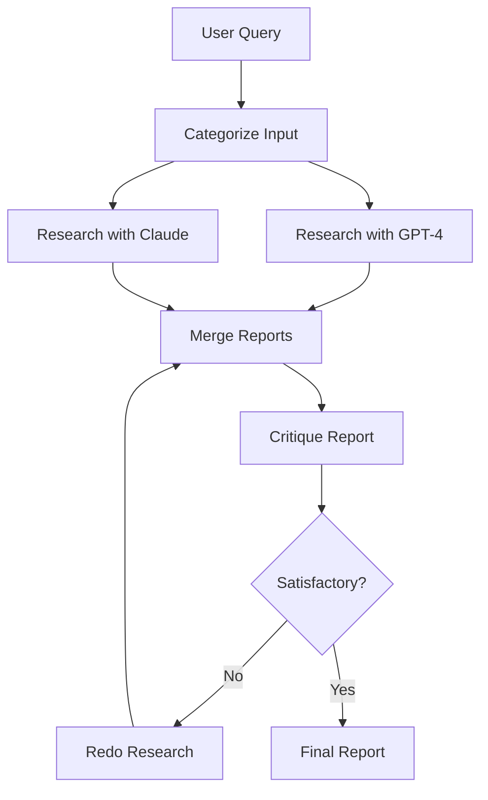

# 🤖 Embabel Agent Examples

A comprehensive collection of intelligent agents demonstrating the power of the [Embabel Agent Framework](https://github.com/embabel/embabel-agent) for building agentic AI workflows in Java and Kotlin.

## 🌟 What Are Agentic Workflows?

Think of agents as **intelligent consultants** that can:
- 🔍 Research topics using web tools
- 🎭 Make decisions based on context
- 🔄 Execute multi-step workflows
- 🤝 Collaborate with other agents
- 🎯 Self-improve through critique and iteration

## 📁 Project Structure

```
embabel-agent-examples/
├── examples-common/          # Shared utilities and models
├── examples-java/           # Java agent implementations  
├── examples-kotlin/         # Kotlin agent implementations
├── scripts/                 # Startup scripts for running agents
│   ├── kotlin/             # Kotlin-specific startup scripts
│   ├── java/               # Java-specific startup scripts  
│   └── support/            # Environment validation scripts
└── pom.xml                 # Maven parent configuration
```

## 🚀 Quick Start

### Prerequisites

- **Java 21** or newer
- **Maven 3.9+**
- [Embabel Agent Parent Project](https://github.com/embabel/embabel-agent) built locally
- **At least one LLM API key** (OpenAI or Anthropic)

### 1. Build the Project

```bash
# Build all examples
mvn clean install

# Or build specific module
cd examples-kotlin && mvn clean install
```

### 2. Set Up API Keys

You need **at least one** of these API keys:

```bash
# OpenAI (recommended for beginners)
export OPENAI_API_KEY="your_openai_key"           # Get from https://platform.openai.com/api-keys

# Anthropic Claude (advanced features)
export ANTHROPIC_API_KEY="your_anthropic_key"     # Get from https://www.anthropic.com/api

# Optional: For Movie and Research agents
export OMDB_API_KEY="your_omdb_key"               # Get from http://www.omdbapi.com/
export X_RAPIDAPI_KEY="your_rapidapi_key"         # Get from https://rapidapi.com/
```

### 3. Run the Agent Shell

#### Unix/Linux/macOS (Kotlin Examples)
```bash
cd scripts/kotlin
./shell.sh
```

#### Windows (Kotlin Examples)
```cmd
cd scripts\kotlin
shell.cmd
```

#### For Java Examples
```bash
cd scripts/java
./shell.sh    # Unix/Linux/macOS
shell.cmd     # Windows
```

The environment check script will verify your API keys and warn you about missing dependencies.

## 🏗️ Architecture Overview

Each agent follows the **Embabel Agentic Pattern**:

```kotlin
@Agent(description = "Agent purpose")
class MyAgent {
    
    @Action(pre = ["condition"], post = ["result"])
    fun performTask(input: Input, context: OperationContext): Output {
        // Agent logic here
    }
    
    @Condition(name = "condition")
    fun checkCondition(context: OperationContext): Boolean = true
    
    @AchievesGoal(description = "Final goal")
    fun completeTask(result: Output): FinalResult = result
}
```

## 📚 Examples Library

---

## 🔧 Shared Utilities

### InMemoryCrudRepository

The `examples-common` module provides a thread-safe, in-memory implementation of Spring Data's `CrudRepository`:

```kotlin
open class InMemoryCrudRepository<T : Any>(
    private val idGetter: (T) -> String?,
    private val idSetter: ((T, String) -> T),
) : CrudRepository<T, String> {
    
    private val storage = ConcurrentHashMap<String, T>()
    
    // Full CRUD operations with UUID generation
    // Thread-safe concurrent access
    // Perfect for demos and testing
}
```

**Use Cases:**
- 🎯 **Movie Buffs Storage** - Stores user preferences and ratings
- 📊 **Demo Data** - Quick setup without database dependencies  
- 🧪 **Testing** - Isolated test environments
- 🔄 **Prototyping** - Rapid development without persistence setup

### HoroscopeService

Shared horoscope generation service used across both Java and Kotlin implementations:

```kotlin
// Common service for astrological predictions
// Provides consistent horoscope data across agents
// Supports multiple astrological systems
```

**Location:** `examples-common/src/main/kotlin/com/embabel/example/`

## 🎬 Movie Recommendation System

**Language:** Kotlin | **Domain:** Entertainment | **Complexity:** Advanced

### What It Does
An intelligent movie consultant that analyzes your taste profile, researches current trends, and recommends personalized movies available on your streaming services.

### Key Features
- 🎭 **Taste Profile Analysis** - Uses AI to understand your movie preferences
- 📰 **Contextual Research** - Finds relevant news for topical recommendations  
- 🔍 **Smart Filtering** - Only suggests movies you haven't seen
- 📺 **Streaming Integration** - Checks availability on your services
- ✍️ **Personalized Writeups** - Creates Roger Ebert-style recommendations

### Agent Workflow


### How to Use
```bash
# In the agent shell
movie-finder recommend movies for alex based on recent sci-fi trends
```

### Domain Models
```kotlin
data class MovieBuff(
    val name: String,
    val movieRatings: List<MovieRating>,
    val countryCode: String,
    val streamingServices: List<String>
) : Person

data class StreamableMovie(
    val movie: MovieResponse,
    val availableStreamingOptions: List<StreamingOption>
)
```

**Location:** `examples-kotlin/src/main/kotlin/com/embabel/example/movie/`
**Requirements:** `OMDB_API_KEY`, `X_RAPIDAPI_KEY`

---

## 🔬 Multi-Model Research Agent

**Language:** Kotlin | **Domain:** Research | **Complexity:** Expert

### What It Does
A sophisticated research assistant that uses multiple AI models (GPT-4 and Claude) to conduct comprehensive research with self-critique and improvement.

### Key Features
- 🧠 **Multi-Model Approach** - Leverages both OpenAI and Anthropic models
- 🔄 **Self-Improvement** - Critiques its own work and redoes research if needed
- ⚡ **Parallel Execution** - Runs multiple research tasks concurrently
- 🎯 **Smart Categorization** - Adapts approach for questions vs. discussions
- 🌐 **Web Integration** - Uses advanced browser automation tools

### Agent Workflow


### How to Use
```bash
# In the agent shell
research "What are the latest developments in quantum computing?"
research "Compare renewable energy policies across EU countries"
```

### Configuration
```kotlin
@ConfigurationProperties(prefix = "embabel.examples.researcher")
data class ResearcherProperties(
    val maxWordCount: Int = 300,
    val claudeModelName: String = AnthropicModels.CLAUDE_35_HAIKU,
    val openAiModelName: String = OpenAiModels.GPT_41_MINI
)
```

**Location:** `examples-kotlin/src/main/kotlin/com/embabel/example/dogfood/research/`

---

## 📊 Presentation Generation System

**Language:** Kotlin | **Domain:** Content Creation | **Complexity:** Expert

### What It Does
An AI-powered presentation creator that researches topics, generates slide content, creates diagrams, and formats everything into professional presentations.

### Key Features
- 📋 **Research Planning** - Identifies key topics to research
- 🔍 **Multi-Source Research** - Web research + code analysis
- 📈 **Diagram Generation** - Creates GraphViz diagrams automatically
- 🎨 **Smart Formatting** - Outputs Marp-compatible markdown
- 🖼️ **Image Integration** - Adds relevant illustrations
- 🎯 **Code Integration** - Finds and formats code examples

### Agent Workflow


### How to Use
```bash
# Create presentation from YAML config
make-presentation --file=path/to/presentation-config.yml
```

### Sample Configuration
```yaml
slideCount: 10
presenterBio: "Senior Kotlin Developer"
brief: "Introduction to Kotlin Coroutines for Enterprise Applications"
softwareProject: "/path/to/kotlin/project"
outputDirectory: "/Users/alex/presentations"
header: |
  ---
  theme: default
  class: lead
  ---
```

**Location:** `examples-kotlin/src/main/kotlin/com/embabel/example/dogfood/presentation/`

---

## 🌟 Horoscope Service

**Language:** Java & Kotlin | **Domain:** Entertainment | **Complexity:** Beginner

### What It Does
A fun astrological agent that provides personalized horoscope readings with star news integration.

### Key Features (Java Implementation)
```java
@Agent(description = "Find news based on a person's star sign")
public class StarNewsFinder {
    
    @Action
    public PersonImpl extractPerson(UserInput userInput) {
        // Extract person details from user input
    }
    
    @Action(toolGroups = {CoreToolGroups.WEB})
    public RelevantNewsStories findNewsStories(StarPerson person, Horoscope horoscope) {
        // Use web tools to find relevant news based on horoscope
    }
    
    @AchievesGoal(description = "Write an amusing writeup for the target person")
    @Action
    public Writeup writeup(StarPerson person, RelevantNewsStories relevantNewsStories) {
        // Generate entertaining writeup combining horoscope and news
    }
}
```

### Key Features (Kotlin Implementation)
```kotlin
@Agent(description = "Find star news and horoscopes")
class StarNewsFinder {
    
    @Action(toolGroups = [CoreToolGroups.WEB])
    fun findStarNews(starPerson: StarPerson): RelevantNewsStories
}
```

### How to Use
```bash
# In the agent shell
horoscope for Leo born on August 15th
star-news for Virgo this week
```

**Locations:** 
- Java: `examples-java/src/main/java/com/embabel/example/horoscope/`
- Kotlin: `examples-kotlin/src/main/kotlin/com/embabel/example/horoscope/`

---

## ✅ Fact Checking Agent

**Language:** Kotlin | **Domain:** Verification | **Complexity:** Advanced

### What It Does
An intelligent fact-checker that extracts claims from content and verifies them using web research.

### Key Features
- 📝 **Claim Extraction** - Identifies factual assertions in text
- 🔍 **Web Verification** - Researches claims using reliable sources
- ⚖️ **Evidence Evaluation** - Assesses the credibility of sources
- 📊 **Detailed Reports** - Provides reasoning for each fact-check

### How to Use
```bash
# Check facts in a document or statement
fact-check "The latest climate change statistics show..."
```

**Location:** `examples-kotlin/src/main/kotlin/com/embabel/example/dogfood/factchecker/`

---

## 🔧 API Configuration

### Required API Keys

**At least one LLM provider is required:**

| Service | Purpose | Get Key From | Environment Variable |
|---------|---------|-------------|-------------------|
| OpenAI | GPT models (recommended) | https://platform.openai.com/api-keys | `OPENAI_API_KEY` |
| Anthropic | Claude models | https://www.anthropic.com/api | `ANTHROPIC_API_KEY` |

**Optional for enhanced features:**

| Service | Purpose | Get Key From | Environment Variable |
|---------|---------|-------------|-------------------|
| OMDB | Movie information | http://www.omdbapi.com/ | `OMDB_API_KEY` |
| RapidAPI | Streaming availability | https://rapidapi.com/ | `X_RAPIDAPI_KEY` |

### Setting Up API Keys

#### Linux/macOS (.bashrc or .zshrc)
```bash
# Required (at least one)
export OPENAI_API_KEY="your_openai_key_here"
export ANTHROPIC_API_KEY="your_anthropic_key_here"

# Optional for Movie agent
export OMDB_API_KEY="your_omdb_key_here"
export X_RAPIDAPI_KEY="your_rapidapi_key_here"
```

#### Windows (Environment Variables)
```cmd
setx OPENAI_API_KEY "your_openai_key_here"
setx ANTHROPIC_API_KEY "your_anthropic_key_here"
setx OMDB_API_KEY "your_omdb_key_here"
setx X_RAPIDAPI_KEY "your_rapidapi_key_here"
```

#### Docker
```bash
docker run -e OPENAI_API_KEY=your_key -e ANTHROPIC_API_KEY=your_key embabel-agent
```

The startup scripts automatically validate your environment and will warn you about missing API keys.

## 🏃‍♂️ Running Specific Examples

### Maven Profiles

The project uses Maven profiles to control which examples are loaded:

- **`agent-examples-kotlin`** - Loads Kotlin agents (default)
- **`agent-examples-java`** - Loads Java agents

### Using the Startup Scripts

#### For Kotlin Examples (Default)
```bash
cd scripts/kotlin
./shell.sh          # Unix/Linux/macOS
shell.cmd            # Windows
shell_docker.sh      # Unix with Docker Desktop profile
shell_docker.cmd     # Windows with Docker Desktop profile
```

#### For Java Examples
```bash
cd scripts/java
./shell.sh          # Unix/Linux/macOS
shell.cmd            # Windows
```

#### MCP Server Mode
```bash
cd scripts/kotlin
./mcp_server.sh      # Unix/Linux/macOS
mcp_server.cmd       # Windows
```

### Manual Maven Execution

#### Kotlin Examples
```bash
cd examples-kotlin
export SPRING_PROFILES_ACTIVE=shell,starwars,docker-desktop
mvn -P agent-examples-kotlin -Dmaven.test.skip=true spring-boot:run
```

#### Java Examples  
```bash
cd examples-java
export SPRING_PROFILES_ACTIVE=shell,starwars,docker-desktop
mvn -P agent-examples-java -Dmaven.test.skip=true spring-boot:run
```

### IDE Setup (IntelliJ IDEA)

1. Open Maven view: **View → Tool Windows → Maven**
2. Expand **Profiles** section
3. Check `agent-examples-kotlin` or `agent-examples-java`
4. Run the appropriate `AgentExampleApplication` main class


## 🧪 Testing

### Run All Tests
```bash
mvn test
```

### Run Specific Module Tests
```bash
cd examples-kotlin
mvn test
```

### Example Test Classes
- `MovieFinderTest.kt` - Unit tests for movie recommendations
- `PresentationMakerTest.kt` - Tests for presentation generation
- `ResearcherTest.kt` - Tests for research capabilities

## 🛠️ Development Tips

### Key Kotlin Features Demonstrated

- **Data Classes with Behavior** - Rich domain models
- **Type Aliases** - Domain-specific types (`typealias OneThroughTen = Int`)
- **Extension Functions** - Enhanced functionality
- **Coroutines** - Parallel execution (`parallelMap`)
- **Delegation** - Clean composition patterns

### Spring Framework Patterns

- **Configuration Properties** - Type-safe configuration
- **Conditional Beans** - Environment-specific components
- **Component Scanning** - Automatic agent discovery
- **Shell Integration** - CLI interfaces

### Agent Design Patterns

- **Workflow Orchestration** - Multi-step processes
- **Blackboard Pattern** - Shared data between actions
- **Human-in-the-Loop** - Confirmations and approvals
- **Self-Improvement** - Critique and retry loops

## 🚨 Troubleshooting

### Common Issues

#### "No LLM API Keys" Error
```bash
# Error: Both OPENAI_API_KEY and ANTHROPIC_API_KEY are missing
# Solution: Set at least one API key
export OPENAI_API_KEY="your_key_here"
# or
export ANTHROPIC_API_KEY="your_key_here"
```

#### "Agent not found" Error
```bash
# Ensure correct Maven profile is active
cd scripts/kotlin && ./shell.sh  # For Kotlin
cd scripts/java && ./shell.sh    # For Java
```

#### Movie Agent "API Key Missing" Error
```bash
# Movie agent requires additional API keys
export OMDB_API_KEY="your_omdb_key"
export X_RAPIDAPI_KEY="your_rapidapi_key"
```

#### Missing Dependencies
```bash
# Clean and rebuild
mvn clean install

# Check parent project is built
cd ../embabel-agent && mvn clean install
```

#### Memory Issues
```bash
# Increase Maven memory
export MAVEN_OPTS="-Xmx2048m -XX:MaxPermSize=512m"
```

#### Environment Validation
```bash
# Run environment check manually
cd scripts/support
./check_env.sh
```

### Debug Mode

Enable detailed logging by setting environment variables:
```bash
export SPRING_PROFILES_ACTIVE=shell,starwars,docker-desktop,debug
```

Or add to your IDE configuration:
```yaml
# application.yml
logging:
  level:
    com.embabel: DEBUG
    org.springframework: INFO
```

## 🤝 Contributing

1. **Fork** the repository
2. **Create** a feature branch (`git checkout -b feature/amazing-agent`)
3. **Commit** your changes (`git commit -m 'Add amazing agent'`)
4. **Push** to the branch (`git push origin feature/amazing-agent`)
5. **Open** a Pull Request

### Agent Development Guidelines

- Use `@Agent` annotation for agent classes
- Implement clear `@Action` methods with pre/post conditions
- Add comprehensive documentation and examples
- Include unit tests for core functionality
- Follow domain-driven design principles

## 📄 License

Licensed under the Apache License 2.0. See [LICENSE](LICENSE) for details.

## 🔗 Links

- [Embabel Agent Framework](https://github.com/embabel/embabel-agent)
- [Contributing Guidelines](https://github.com/embabel/embabel-agent/blob/main/CONTRIBUTING.md)
- [Documentation](https://embabel.com/docs)
- [Community Discord](https://discord.gg/embabel)

---

**Happy Agent Building! 🚀**